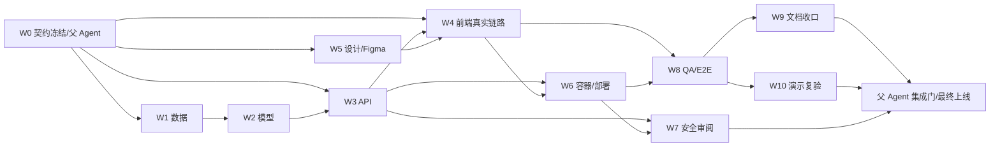

# 连续化工过程偏移副驾驶多 Agent 协作编排规范 v01

状态：`DRAFT`  
适用项目：`03_产品与解决方案/03_连续化工过程偏移副驾驶/`  
编排日期：`2026-08-28`  
主控：父 Agent（契约、冲突消解、端到端复验与最终上线）

本规范是当前项目的可执行协作规则。每个 Agent 只在自己的写入边界内工作，以测试、构建、截图或部署输出作为交付证据；没有证据的“完成”不进入下一道门。

## 1. 目标与非目标

### 1.1 目标

- 并行完成 TEP 公开仿真数据回放、偏移发现、故障研判、Top-3 变量证据、处置建议、人工确认和审计记录。
- 保持主链路可离线运行：LLM 只能作为改写层；LLM 超时或关闭时必须回退到模板建议。
- 用唯一文件所有权消除并发覆盖；用契约冻结、独立审阅和父 Agent 复验控制集成风险。
- 在单机 Docker Compose 上完成可重复构建，并在 `wunoos` 上以独立 Compose project 发布和回滚。
- 对外演示如实标注：数据来自 Tennessee Eastman Process 仿真，不等同于贵州磷化工真实生产数据；产品只读，不自动写回 DCS/PLC。

### 1.2 非目标

- 不把 Demo 扩展成生产控制系统，不自动操作阀门、联锁或控制回路。
- 不宣称覆盖 21 类故障的生产级准确率，也不从仿真数据推断真实装置的误报率、漏报率、提前量或经济收益。
- 不在并行工作阶段重写 Git 历史、删除业务文件、清理服务器其它容器或执行全局 Docker prune。
- 不引入第二套品牌 token；产品语义 token 只能映射 Wuno/WUWUI 核心 token。
- 不让多个 Agent 同时编辑同一文件；不把缓存、`.venv`、`node_modules`、`.next` 或本地数据库当作交付产物。

## 2. 基线事实与事实源

| 事实 | 当前状态 | 事实源/证据 |
|---|---|---|
| 数据修正与复核 | 已完成，23 tests | `services/ml/tests/`；命令见 [实施计划](2026-08-28_连续化工过程偏移副驾驶_实施计划_v01_DRAFT.md) Task 2 |
| 后端修正与复核 | 已完成，19 tests | `apps/api/tests/`；同一实施计划 Task 3 |
| 前端真实链路 | 已完成，27 tests | `apps/web/tests/live-api-chain.test.ts`、`apps/web/tests/container-integration.test.ts` |
| 共享契约 | 已存在，父 Agent 负责冻结与冲突消解 | [`packages/contracts/openapi.yaml`](../../packages/contracts/openapi.yaml)、[`packages/contracts/schemas/domain.schema.json`](../../packages/contracts/schemas/domain.schema.json) |
| Figma 设计系统 | 文件已创建，待独立审阅和代码对齐 | [WunoOS - 连续化工过程偏移副驾驶](https://www.figma.com/design/lpsBWvjCx54fF28rWLMpBx)；本地规则见 [`design-system/连续化工过程偏移副驾驶/MASTER.md`](../../design-system/连续化工过程偏移副驾驶/MASTER.md) |
| 基础设施 | 五服务镜像已构建并部署，远端 release `20260828T0435Z` 全部 healthy | [`infra/compose.yaml`](../../infra/compose.yaml)、[`infra/tests/validate_infra.sh`](../../infra/tests/validate_infra.sh)、[`docs/deployment.md`](../deployment.md) |
| 远端 E2E | 已通过 | [`tests/e2e/smoke.sh`](../../tests/e2e/smoke.sh)；覆盖真实 run/event、两阶段时序、幂等 409、人工确认、审计和非法 SSE 游标 |
| 产品边界 | 公开仿真 Demo、读侧建议、人工确认留痕 | [`README.md`](../../README.md)、[`docs/submission/数据说明_v01_DRAFT.md`](../submission/数据说明_v01_DRAFT.md) |

所有 Agent 开始前先阅读项目 [`README.md`](../../README.md)、本规范和自己边界内的文件；涉及产品设计时还必须阅读 [`方案设计_v01_DRAFT.md`](2026-08-28_连续化工过程偏移副驾驶_方案设计_v01_DRAFT.md) 与设计系统 Master。

## 3. 分层 Work Breakdown

### 3.1 工作线总表

| ID | 工作线 | 主要产出 | 唯一写入边界 | 依赖 | 当前状态 |
|---|---|---|---|---|---|
| W0 | 契约与集成总控 | OpenAPI/schema 冻结、冲突决议、集成记录 | `packages/contracts/**`、项目根级工作区文件 | 无 | 父 Agent 负责 |
| W1 | 数据 | TEP 原始包校验、分层 Parquet、变量字典、manifest | `data/manifests/**`、`data/processed/**`、必要的原始数据只读引用 | W0 的数据字段约定 | 已完成 |
| W2 | 模型 | PCA T²/SPE、Top-3 贡献、故障分类、模板建议、确定性场景 | `services/ml/**` | W1 的数据产物 | 已完成 |
| W3 | API | FastAPI、回放状态机、SSE、决策/审计、降级和幂等 | `apps/api/**` | W0、W1/W2 的产物格式 | 已完成 |
| W4 | 前端 | Next.js 驾驶舱、真实 API/SSE 链路、全状态、响应式和可访问性 | `apps/web/**` | W0、W3；设计 token 可先用已冻结版本 | 已完成，视觉复核收尾中 |
| W5 | 设计 | Figma 页面/组件/变量、代码 token 对齐、状态与截图台账 | Figma 文件、`design-system/连续化工过程偏移副驾驶/**`、`packages/ui/src/tokens.css`、`packages/ui/src/index.ts` | W0 的页面/状态范围 | Figma 文件与代码 token 已创建；页面资产仍需独立补齐 |
| W6 | 基础设施 | Compose、镜像、健康检查、CI、部署/备份/回滚 | `infra/**`、`.github/workflows/ci.yml`、`docs/deployment.md` | W3/W4 可构建 | 已部署，五服务 healthy |
| W7 | 安全 | 只读边界、凭证/日志/网络检查、依赖和容器硬化审阅 | 默认不直接写文件；修复回交给对应文件所有者 | W3/W4/W6 | 已完成独立审阅与修正 |
| W8 | QA | 契约、单元、组件、E2E、故障注入、连续演示复验 | `tests/e2e/**`；报告使用 Agent 消息或父 Agent 指定位置 | W0/W1/W2/W3/W4/W6 | 69 项测试及远端 E2E 已通过 |
| W9 | 文档 | 数据说明、部署说明、作品说明、运行手册、协作规范 | `docs/submission/**`、`docs/deployment.md`、本文件（本轮仅本文件） | W1/W3/W6/W8 证据 | 已按部署与验收证据收口 |
| W10 | 演示 | 3 分钟脚本、固定场景、演示前检查和失败兜底 | `docs/submission/三分钟Demo脚本_v01_DRAFT.md`、演示记录不回写业务代码 | W4/W8/W9 | 脚本已完成，连续现场彩排待执行 |

### 3.2 各工作线的可执行边界

**W1 数据。** 只处理公开 TEP 数据和可追溯产物：安全解包、`d00.dat` 的 `52×500` 转置、故障文件行列、故障起点 160、20 点窗口和禁止跨 run 切窗。不得重命名为真实企业数据，不得修改模型逻辑文件。

**W2 模型。** 只消费 W1 的结构化数据，输出 PCA 检测、变量贡献、分类 Top-3、模型版本和确定性场景。处置建议必须来自安全规则/模板；不得生成控制指令，不得把分类结果包装成生产级诊断。

**W3 API。** 以冻结 OpenAPI 为边界实现健康检查、场景、回放、SSE、事件、人工决策和审计。必须支持 `Last-Event-ID` 重连、幂等键、统一错误包、trace id 及 LLM degraded 回退；不得在 API 中复制另一份 DTO 契约。

**W4 前端。** 以生成的 API 类型和 client 为唯一接口入口，完成 `/demo`、`/overview`、`/replay`、`/events`、`/events/[id]`、`/records/[id]`、`/system`。必须覆盖 loading/error/empty/degraded/offline/read-only，不能用静态 mock 替代真实链路测试。

**W5 设计。** Figma 使用 WunoOS/WUWUI 核心 token，产品层只增加语义别名；覆盖 `ReplayControl`、`DataFreshness`、`RiskBanner`、`Evidence`、`Recommendation`、`HumanDecision`、`AuditTimeline` 的正常、偏移、严重告警、加载、错误、空态、不可用、只读状态。不得把 `AUTO_GENERATED_CANDIDATE.md` 的 Insurance Platform、独立青绿色板或 Fira 字体带入实现。

**W6 基础设施。** 先做 `config`、shell 语法和安全校验，再 build/up/health/E2E；PostgreSQL 不发布宿主端口，服务以非 root、只读根文件系统、丢弃 capabilities、日志轮转运行。远端只能使用独立目录 `/opt/process-copilot`、独立 project `process-copilot` 和高位端口 `18090`，不得影响既有服务。

**W7 安全。** 以审阅者身份检查凭证是否进入日志/镜像、数据库是否公网暴露、部署脚本是否跨项目操作、读侧边界是否被绕过；发现问题只给出复现命令和修复建议，直接修复时必须由文件所有者执行。

**W8 QA。** 先验证各 Agent 的 RED→GREEN 证据，再做独立审阅和故障注入：API 暂停、SSE 断线、LLM 不可用、重复幂等请求、错误 trace id、数据/模型 hash 漂移。E2E 必须从创建回放走到人工确认和审计记录。

**W9 文档。** 只记录已经由代码、测试、部署或设计截图证明的事实；数据说明必须保留上游来源、SHA-256、许可证和不能推断的结论。文档不得把“待启动”写成“已完成”。

**W10 演示。** 使用冻结的确定性场景，按“回放→发现→证据→建议→人工确认→审计”演示；网络、SSE 或 LLM 失败时切换到已验证的离线/降级路径，并在口播中说明限制。

## 4. 并行 DAG 与关键路径

### 4.1 依赖图



### 4.2 可并行分组

| 波次 | 可并行任务 | 不能提前做的事 | 汇合门 |
|---|---|---|---|
| N0 基线 | W4 前端真实链路、W5 设计审阅、W6 Compose config/build 前置、W7 只读安全审阅 | 不在契约未冻结时改变响应字段；不在应用未构建时宣称容器可运行 | M1：契约与数据/模型产物 hash 确认 |
| N1 集成 | W4 收口、W6 本地镜像与 Compose、W8 编写 E2E、W9 整理已存在事实 | 不让 QA 在代码仍变动时给出最终 PASS | M2：前端/API/容器均 GREEN |
| N2 独立验证 | W7 全面安全复核、W8 E2E/故障注入、W5 Figma/截图审阅、W10 演示彩排 | 不修改被审阅者文件；缺陷回交原 owner | M3：独立审阅无 P0/P1 |
| N3 发布 | 父 Agent 本地 E2E、W9 文档证据收口、W10 固定脚本、W6 远端预检 | 不先连接正式入口；不覆盖既有 release | M4：父 Agent 复验通过 |
| N4 上线 | W6 执行 `wunoos` 部署，W8 做远端 smoke/回滚验证，W10 现场演示检查 | 不清理服务器其它容器或全局卷 | M5：最终上线门 |

### 4.3 关键路径

关键路径是：`W0 契约冻结 → W3 API → W4 前端真实链路 → W6 本地容器 → W8 本地 E2E/故障注入 → 父 Agent 复验 → W6 远端发布 → W8 远端 smoke/回滚 → 最终上线`。

W1/W2 必须已完成并提供 hash，W5 设计审阅可与 W4 并行但在最终 UI 门前必须汇合；W7 安全审阅不能被文档或演示进度替代。

## 5. RACI 与唯一文件所有权矩阵

角色缩写：`P` 父 Agent，`D` 数据，`M` 模型，`A` API，`F` 前端，`S` 设计，`I` 基础设施，`X` 安全，`Q` QA，`C` 文档，`V` 演示。

### 5.1 RACI

| 工作流 | R（执行） | A（最终负责） | C（咨询） | I（知会） |
|---|---|---|---|---|
| 契约与冲突 | P | P | A/F/M | 全部 |
| 数据与模型 | D/M | P | A/Q | F/I/C/V |
| API 与审计 | A | P | M/F/X/Q | C/V |
| 前端真实链路 | F | P | A/S/Q | I/C/V |
| Figma 与 token | S | P | F/C | A/Q |
| Compose/部署 | I | P | A/F/X/Q | C/V |
| 安全 | X | P | A/I/M/F | 全部 |
| QA/E2E | Q | P | 全部 | C/V |
| 文档 | C | P | D/M/A/I/Q | 全部 |
| 演示 | V | P | F/A/C/Q | 全部 |

### 5.2 唯一文件所有权

| Owner | 允许写入 | 只读输入 | 明确禁止 |
|---|---|---|---|
| P | `packages/contracts/**`、根级 `package.json`、`pnpm-workspace.yaml`、`pyproject.toml`、`Makefile`、根 `.env.example`、集成记录 | 全部工作线 | 不在别人 GREEN 后无记录地改契约 |
| D/M | `services/ml/**`、`data/manifests/**`、`data/processed/**` | 原始 ZIP、契约 | 不改 API/UI/部署；不手工编辑生成 Parquet、joblib |
| A | `apps/api/**` | `packages/contracts/**`、`data/processed/**` | 不改前端 DTO 或契约源 |
| F | `apps/web/**` | `packages/contracts/**`、`packages/ui/**`、Figma | 不改 API、infra、模型产物 |
| S | Figma 文件、`design-system/连续化工过程偏移副驾驶/**`、`packages/ui/src/tokens.css`、`packages/ui/src/index.ts` | Wuno 核心设计系统 | 不改 `apps/web/**`；不 detach AppSidebar |
| I | `infra/**`、`.github/workflows/ci.yml`、`docs/deployment.md` | 应用 Docker build 输入 | 不改应用逻辑；不操作其它 Compose project |
| X | 默认无写入；修复由对应 owner 写入 | 全部代码、配置、日志 | 不直接覆盖业务文件或绕过 owner |
| Q | `tests/e2e/**`、测试报告消息 | 全部可运行产物 | 不改被测实现以“修绿” |
| C | `docs/submission/**`、本文件；部署文档由 I 维护 | 测试/部署/设计证据 | 当前任务不得写本表之外的文件 |
| V | `docs/submission/三分钟Demo脚本_v01_DRAFT.md` 中演示段落与外部演示记录 | 已冻结 build/release | 不改业务代码和数据 |

生成目录 `.next/`、`node_modules/`、`.venv/`、`__pycache__/`、`.pytest_cache/`、`.ruff_cache/`、本地 `process_copilot.db` 不属于任何 Agent 的交付边界。

## 6. 标准任务简报模板

### 6.1 所有 Agent 必须使用的简报

```text
任务编号与工作线：说明属于 W1–W10 的哪一项。
目标：写出一个完成后可观察、可测试的结果。
已知事实：引用现有文件、测试数量、版本、数据 hash 或父 Agent 决策。
输入与依赖：列出允许读取的路径、契约版本和前置门。
允许写入：只列本任务的精确文件/目录；生成物标明生成命令。
禁止事项：列出不得修改的路径、不得做的外部操作和产品边界。
实施范围：按文件、符号、接口或页面列出最小变更。
验证命令：给出可以在项目根执行的完整命令，包含预期退出码或断言。
交付证据：给出测试摘要、构建日志关键行、截图路径、hash、URL 或部署检查结果。
失败升级：说明阻塞等级、复现命令、最近一次失败输出和需要父 Agent 决策的选项。
状态：只使用 RUNNING、RED、GREEN、REVIEW、BLOCKED、DONE 之一。
```

### 6.2 按类别追加的简报约束

| 类别 | 简报中必须额外写明 | 最小验证证据 |
|---|---|---|
| 数据 | 原始来源、SHA-256、shape、采样间隔、故障起点、是否跨 run | `python3.12 -m pytest services/ml/tests -q`；manifest/hash 对比 |
| 模型 | 训练/推理输入、模型版本、Top-3 定义、确定性条件、控制写回禁令 | 模型单测、重复生成 manifest/hash 一致 |
| API | 对应 operationId、状态码、Problem/trace/idempotency 行为、SSE cursor | `python3.12 -m pytest apps/api/tests -q`；OpenAPI surface 对比 |
| 前端 | 使用的生成类型、真实 API 入口、全状态、响应式断点、键盘/文本摘要 | `pnpm --filter web test`、`typecheck`、`lint`、`build` |
| 设计 | Figma 节点/变量名、核心 token 映射、组件状态、截图与对比度 | Figma metadata + screenshot；本地 token diff |
| 基础设施 | project name、端口、网络、健康检查、资源限制、回滚 release | `bash infra/tests/validate_infra.sh`、`bash -n infra/scripts/*.sh`、Compose config |
| 安全 | 威胁/边界、复现命令、影响面、修复 owner，不把建议当作已修复 | 命令输出、日志脱敏检查、网络/权限检查 |
| QA | 测试层级、环境、固定场景、预期行为、失败注入和证据保留 | 独立测试输出、失败 case、重跑结果 |
| 文档 | 事实来源、读者、发布日期/状态、禁止声称、链接目标 | Markdown 链接检查、命令可执行性、事实与代码核对 |
| 演示 | 固定场景、时间段、操作、预期画面、离线兜底、口播限制 | 连续 5 次演示记录，主链路和降级均可重现 |

父 Agent 派发任务时，直接复制 6.1 模板并填入 6.2 的类别约束；没有“允许写入”和“验证命令”的简报不启动。

## 7. 并发写冲突规则与共享文件冻结窗口

### 7.1 冲突规则

1. 单文件单 owner。目录 owner 不能把同一文件临时借给别人；需要跨边界修复时提交“建议补丁”，由原 owner 写入。
2. 开始前执行 `git status --short` 和 `git diff --name-only`，确认已有变更属于谁；不撤销、不覆盖、不顺手整理与任务无关的改动。
3. 开始和结束都向父 Agent 汇报：`状态 / 计划写入 / 已写入 / 验证命令 / 证据 / 风险`。结束时附 `git diff --name-only --` 加本任务已批准的真实目录路径。
4. 发现目标文件已被别人修改，立即停止该文件写入，保留只读证据并升级；不得用覆盖、重置或手工合并掩盖冲突。
5. 生成文件只能由生成器写入。修改生成器后必须重新生成并报告新 hash；不得直接编辑 `data/processed/**`、`api-schema.ts` 或 `.next/**`。
6. 安全审阅和 QA 审阅默认只读。缺陷修复回到 owner，修复后重新进入 RED→GREEN，不允许审阅者边测边改实现。

### 7.2 共享文件冻结窗口

| 冻结窗口 | 冻结对象 | 开始条件 | 解冻条件 |
|---|---|---|---|
| F0 契约冻结 | `packages/contracts/**`、生成 API 类型 | W0 发布契约版本和 operationId 清单 | 父 Agent 明确记录版本变更；受影响 W3/W4 重跑测试 |
| F1 数据/模型产物冻结 | `data/processed/**`、`data/manifests/**` | W1/W2 22 tests 与重复 hash 均 GREEN | 发现数据诚实性或可复现性缺陷，并由 P 重新开窗 |
| F2 UI token 冻结 | `packages/ui/**`、Figma 变量和本地 design-system 规则 | S 提供截图/metadata 对齐证据 | P 批准变更；F5 之后只能走版本化变更 |
| F3 发布冻结 | `infra/**`、Dockerfile、应用依赖锁文件 | 本地镜像和 Compose health GREEN | 发布后回滚或下一 release；不得在远端运行时热改 |
| F4 最终 E2E 冻结 | `apps/**`、`packages/contracts/**`、`data/processed/**` | QA 开始独立审阅 | P0/P1 修复后全套回归通过 |

冻结期间允许读，不允许直接写；紧急变更必须由父 Agent 开窗，写明原因、影响范围和回归命令。

## 8. RED → GREEN → 独立审阅 → 父 Agent 复验 → 集成门

### 8.1 每个工作线的门禁循环

| 阶段 | 执行者 | 必须做什么 | 进入下一阶段的证据 |
|---|---|---|---|
| RED | owner | 先写失败测试或失败校验；确认失败原因是缺失实现而非环境损坏 | 命令、失败断言、环境版本 |
| GREEN | owner | 最小实现；只改 owner 边界；跑本线全套测试和 lint/build | 退出码 0、测试数量、产物/hash |
| 独立审阅 | Q/X 或指定 reviewer | 在干净读取视角复跑命令，检查越界、契约、数据诚实性和安全边界 | 审阅结论、发现清单、复跑输出 |
| 父 Agent 复验 | P | 以当前工作树读取真实文件；重跑受影响命令并核对依赖链 | P 的复验命令、结论和允许集成标记 |
| 集成门 | P | 合并逻辑、跑跨服务链路、锁定 release 输入 | 门状态、版本/hash、下一波派发 |

任何阶段失败都回到对应 owner 的 RED；`GREEN` 只代表本线通过，不代表集成通过。

### 8.2 当前项目集成命令顺序

在项目根 `03_产品与解决方案/03_连续化工过程偏移副驾驶/` 执行：

```bash
pnpm lint:contracts
python3.12 -m pytest services/ml/tests -q
python3.12 -m pytest apps/api/tests -q
pnpm --filter web test
pnpm --filter web typecheck
pnpm --filter web lint
pnpm --filter web build
bash infra/tests/validate_infra.sh
bash -n infra/scripts/*.sh
POSTGRES_USER=process_copilot POSTGRES_PASSWORD=test-only-password POSTGRES_DB=process_copilot \
  docker compose -p process-copilot-test -f infra/compose.yaml config --quiet
```

应用已通过本地构建后，再执行容器门：

```bash
docker compose -p process-copilot-test -f infra/compose.yaml build
docker compose -p process-copilot-test -f infra/compose.yaml up -d
docker compose -p process-copilot-test -f infra/compose.yaml ps
curl -fsS http://localhost:18090/healthz
curl -fsS http://localhost:18090/readyz
```

容器 E2E 后仅清理由本次验证创建的 project：

```bash
docker compose -p process-copilot-test -f infra/compose.yaml down
```

远端门由父 Agent 授权后执行。目标主机必须先满足 `wunoos` 的只读审计、`/opt/process-copilot` 专用目录、`process-copilot` project、`18090` 未占用和非默认 `POSTGRES_PASSWORD`，然后执行 [`docs/deployment.md`](../deployment.md) 中的 `deploy.sh`、health、备份和回滚步骤。

## 9. 状态汇报与失败升级协议

### 9.1 固定状态格式

每次状态汇报不超过以下字段，避免只报“在做”：

```text
[工作线/任务编号] [状态] [时间]
已完成：可核验的文件、符号或命令结果。
正在做：当前唯一动作及预计下一个证据。
验证：完整命令、退出码、测试数量或截图/URL。
风险：影响范围、是否阻塞关键路径、是否涉及契约/数据/发布。
需要父 Agent：无，或列出一个明确决策。
```

### 9.2 失败等级

| 等级 | 判定 | 立即动作 | 升级时限 |
|---|---|---|---|
| P0 | 数据造假/越权控制写回、生产或其它项目受影响、凭证泄露、不可回滚 | 停止相关 Agent 和发布；保留现场证据；通知 P | 立即 |
| P1 | 主链路无法完成、契约破坏、容器无法启动、数据库公网暴露、E2E 致命失败 | 停止下游集成；回到 owner 修复并全量回归 | 15 分钟内 |
| P2 | 单页面/非关键降级、无障碍、视觉 token 或文档链接问题 | 记录复现和 owner；不阻塞无关工作线 | 当前波次结束 |
| P3 | 不影响当前 Demo 的优化建议 | 进入后续清单，不得伪装成当前完成项 | 下次计划 |

失败升级消息必须包含复现命令、最近一次完整错误、影响路径、已经尝试的最小修复和父 Agent 需要选择的选项。连续两次同一失败仍无进展，暂停该工作线，交给 P 重新拆分，不得继续扩大写入范围。

## 10. 当前 Agent 队列与下一波编排

### 10.1 已完成

- **D/M：** 数据格式、故障边界、窗口规则、PCA/分类/贡献和确定性产物已修正复核；23 tests 通过。
- **A：** 健康/ready、场景、回放、SSE、幂等、事件、人工决策、审计、错误和 OpenAPI 对齐已修正复核；19 tests 通过。
- **F：** 真实 scenario/run/event/decision/record 链路、两阶段 UI、网络降级边界和贡献值单位已完成；27 tests、typecheck、lint、production build 通过。
- **I：** release `20260828T0435Z` 已部署至 `wunoos`；Web、API、worker、PostgreSQL、Caddy 全部 healthy，远端 E2E 通过。
- **X/Q：** 容器、凭证、日志、数据诚实性与接口边界已独立审阅；Claude Code 结论为 `PASS WITH RISKS`，其中三处过时文档已在本轮修正。
- **S（资产创建）：** Figma 文件已创建；不等于组件、变量、状态、截图和代码 token 已独立审阅通过。

### 10.2 正在运行

- **P/A：** 按 Claude Code 验收残余项补强 SSE 心跳连接语义和模板缺失时的降级证据标识；每个修复独立 commit、独立回归。
- **F：** 修复 390px 视口下关闭侧栏仍造成文档横向滚动的问题，并重新做 390/768/桌面视觉复核。
- **C：** 同步最终测试数、部署 release、E2E 证据与访问边界。

### 10.3 待启动

- **S：** 补齐 Figma 页面级资产、截图、变量绑定和独立对齐审阅。
- **V：** 使用同一冻结场景连续彩排 5 次，记录主链路、网络降级路径和口播限制。
- **I：** 在明确授权后演练一次数据库备份和 rollback；公网安全组保持不变。

### 10.4 下一波具体派发

1. **当前并行：** A 只改 `apps/api/**`；F 只改 `apps/web/**`；C 只改文档。每个问题单独 commit，不交叉暂存。
2. **代码 GREEN 后：** 运行 ML/API/Web、契约、infra 与远端 E2E；任何 API 语义变化都重新生成并校验前端类型。
3. **远端复验后：** 记录新 release、五服务健康状态和安全访问方式；不放行公网高位端口。
4. **现场前：** 补齐 Figma 页面级资产并连续彩排 5 次；最后核对 Definition of Done、数据诚实性和对外措辞。

## 11. Definition of Done

只有父 Agent 在所有条目都有新鲜证据时才能标记完成。

### 11.1 本地代码与 E2E

- `pnpm lint:contracts`、`python3.12 -m pytest services/ml/tests -q`、`python3.12 -m pytest apps/api/tests -q`、前端 test/typecheck/lint/build 均退出码 0。
- E2E 从创建固定场景回放开始，经过偏移发现、事件详情、Top-3 证据、建议、人工确认，最终可读取审计记录。
- 至少验证 API 暂停、SSE 断线并用 `Last-Event-ID` 恢复、LLM 不可用回退、重复幂等请求和统一错误 trace id。
- 关键链路连续运行/演示 5 次；失败时保留复现命令和修复后的重跑证据。

### 11.2 容器与基础设施

- `bash infra/tests/validate_infra.sh`、`bash -n infra/scripts/*.sh`、Compose config、镜像 build、up、health 全部通过。
- Caddy 可通过 `http://localhost:18090/healthz` 和 `/readyz` 访问；PostgreSQL 无宿主机端口；服务非 root、只读根文件系统、无提权、日志轮转和资源限制有效。
- 远端使用独立 `/opt/process-copilot`、`process-copilot` project 和高位端口；没有停止、清理或修改既有容器/防火墙/反向代理配置。
- 已完成一次数据库备份、SHA-256 校验和回滚到上一 release 的演练；回滚后 health 和主链路仍可用。

### 11.3 设计与文档

- Figma 页面、变量、核心组件、全状态、响应式和原型主链路完成 metadata/screenshot 审阅；未绑定变量、对比度和 AppSidebar instance 问题已清零。
- 前端复用 Wuno/WUWUI 核心 token，不出现第二套基础色、任意字号散落定义或只靠红绿表达状态；支持 reduced motion、键盘导航和文本摘要。
- 数据、部署、作品说明和演示脚本中的来源、SHA-256、许可证、限制、命令和入口与实际代码/产物一致；所有相对链接可解析。

### 11.4 数据诚实性与产品边界

- 每次发布携带可追溯 `buildHash`、模型版本和数据 manifest；重复生成在相同输入下 hash 一致。
- 对外材料明确写“TEP 仿真 Demo”，不写成真实磷化工生产数据；不虚构准确率、收益或生产级覆盖范围。
- 建议始终标记为只读分析/人工确认；任何处置内容都不是自动控制指令，不能直接写回 DCS/PLC。
- LLM 关闭、超时或异常时主链路仍可完成，界面明确显示 degraded/offline 状态和最后有效数据时间。

## 12. 相关入口

- 项目入口：[`README.md`](../../README.md)
- 产品方案：[`2026-08-28_连续化工过程偏移副驾驶_方案设计_v01_DRAFT.md`](2026-08-28_连续化工过程偏移副驾驶_方案设计_v01_DRAFT.md)
- 原实施计划：[`2026-08-28_连续化工过程偏移副驾驶_实施计划_v01_DRAFT.md`](2026-08-28_连续化工过程偏移副驾驶_实施计划_v01_DRAFT.md)
- 数据说明：[`docs/submission/数据说明_v01_DRAFT.md`](../submission/数据说明_v01_DRAFT.md)
- 演示脚本：[`docs/submission/三分钟Demo脚本_v01_DRAFT.md`](../submission/三分钟Demo脚本_v01_DRAFT.md)
- 部署说明：[`docs/deployment.md`](../deployment.md)
- 设计系统：[`design-system/连续化工过程偏移副驾驶/MASTER.md`](../../design-system/连续化工过程偏移副驾驶/MASTER.md)
